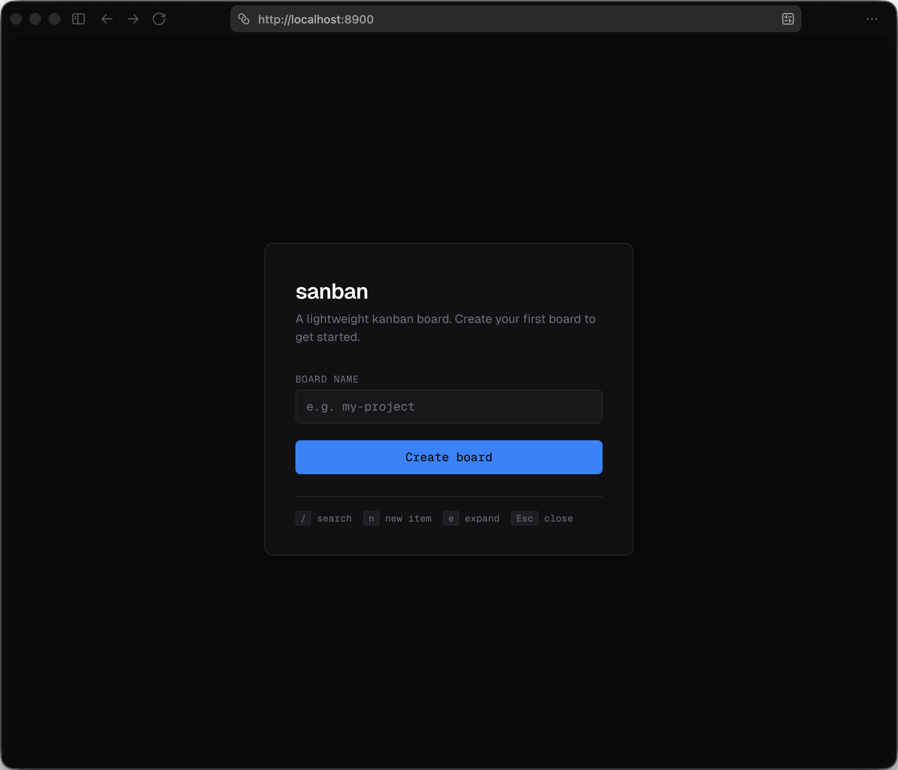
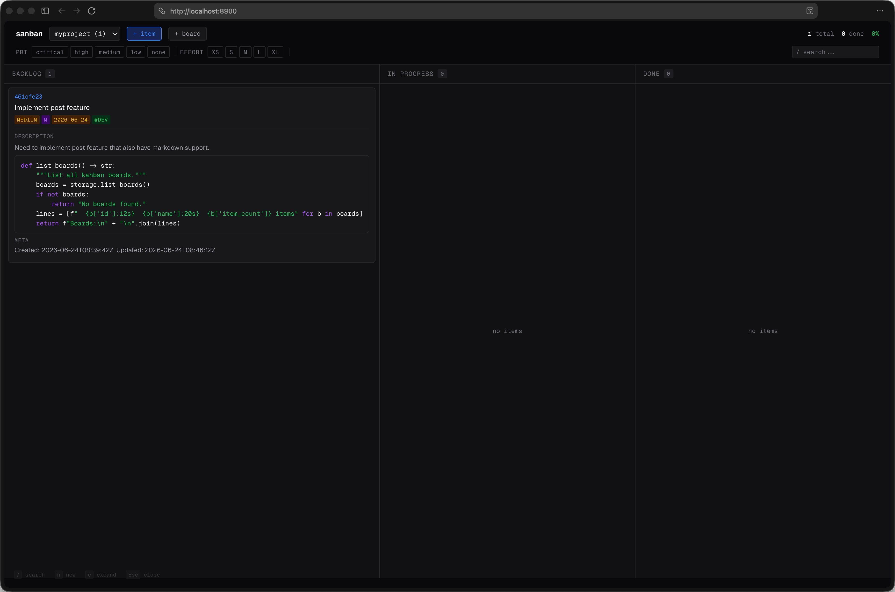

# sanban

Simple kanban that just works. No bloat, no login, no SaaS.

JSON-backed boards with a REST API, MCP server, and a dark UI. For devs who want tasks tracked without the overhead.

## Screenshots




## Quick Start

```bash
uv sync
uv tool install .
sanban              # http://localhost:8900
```

The web server runs independently. Agents connect via MCP separately.

## Features

- Multiple boards with custom columns
- Drag-and-drop between columns
- Priority, effort, tags, assignees, due dates
- Full-text search and filters
- Markdown in titles and descriptions (code blocks with syntax highlighting)
- Edit and delete buttons on every card
- Keyboard shortcuts (`/` search, `n` new, `e` expand)
- Agent-ready via MCP server

## Why

- **No database** — one JSON file per board in `~/.sanban/boards/`, easy to diff, commit, back up
- **No auth** — local-first, runs on localhost
- **No framework** — vanilla JS frontend, Geist font, dark mode
- **Multi-board** — one server, unlimited boards

## REST API

| Method | Endpoint | Description |
|--------|----------|-------------|
| `GET` | `/api/boards` | List all boards |
| `POST` | `/api/boards` | Create board `{ name, columns? }` |
| `GET` | `/api/boards/:id` | Get board with items |
| `DELETE` | `/api/boards/:id` | Delete board |
| `GET` | `/api/boards/:id/items` | List items (`?q=`, `?status=`, `?tag=`, `?assignee=`) |
| `POST` | `/api/boards/:id/items` | Create item |
| `PATCH` | `/api/boards/:id/items/:iid` | Update item |
| `DELETE` | `/api/boards/:id/items/:iid` | Delete item |
| `GET` | `/api/search?q=` | Search across boards |

## MCP Server

Agents interact with boards via MCP stdio. This is a separate process from the web server — both read/write the same JSON files.

### Agent Config (opencode.json)

```json
{
  "mcp": {
    "sanban": {
      "type": "local",
      "command": ["sanban", "--mcp-only"],
      "enabled": true
    }
  }
}
```

Or running from source:

```json
{
  "mcp": {
    "sanban": {
      "type": "local",
      "command": ["uv", "run", "--directory", "/path/to/sanban", "python", "-m", "sanban.server", "--mcp-only"],
      "enabled": true
    }
  }
}
```

> **Other agents:** Adapt the config format for your CLI agent (Claude Desktop, Cursor, etc.). The command is always `sanban --mcp-only` — only the config wrapper changes.

### Tools

| Tool | Description |
|------|-------------|
| `list_boards` | List all boards |
| `create_board(name, columns?)` | Create a new board |
| `get_board(board_id)` | Get board details + items |
| `create_item(board_id, title, ...)` | Add an item |
| `update_item(board_id, item_id, ...)` | Update fields |
| `move_item(board_id, item_id, new_status)` | Move to column |
| `delete_item(board_id, item_id)` | Remove item |
| `search(query, board_id?)` | Search across boards |

## Run Modes

```bash
sanban                # web server (REST API + UI) — keep this running
sanban --mcp-only     # MCP stdio — for agent config
sanban --rest-only    # REST only, no UI
sanban --port 9000    # custom port
```

**Typical setup:** run `sanban` in a terminal (or background it), then add `sanban --mcp-only` to your agent config. Both use the same `~/.sanban/boards/` data.

## Data

Boards live in `~/.sanban/boards/<id>.json`. Override with `SANBAN_DATA_DIR`.

## For Agents

See [SKILL.md](./SKILL.md) for the full agent reference — API examples, MCP tools, item fields, and keyboard shortcuts.

## Tech

Python 3.10+, FastAPI, uvicorn, MCP SDK. No database, no framework, no build step.

## License

MIT
